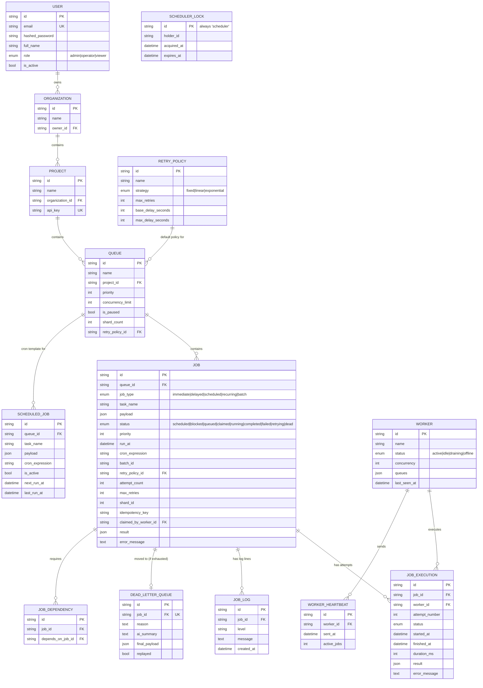

# Entity-Relationship Diagram

## Design rationale

- **UUID string primary keys** everywhere instead of auto-increment
  integers, so IDs are safe to generate client-side, don't leak row
  counts, and merge painlessly across a distributed / multi-region setup.
- **`Job` vs `JobExecution` split.** `Job` holds the current/latest state;
  `JobExecution` is an append-only row per attempt. This gives a full
  audit trail (attempt #2 took 340ms and failed with X) without
  overloading the `Job` row with per-attempt columns.
- **`ScheduledJob` vs `Job` (RECURRING type) split.** `ScheduledJob` is a
  reusable *template* ("run this every 5 minutes"); each firing
  materializes a concrete, independent `Job` row. This keeps the job
  table's semantics simple (a `Job` is always one concrete unit of work)
  and makes recurring-job history queryable exactly like any other job.
- **`RetryPolicy` as its own table**, referenced by both `Queue` (as a
  default) and optionally overridable per `Job`, so a team can define a
  handful of named policies ("fast-fixed", "network-exponential") and
  reuse them instead of duplicating retry config on every job.
- **Composite index `(queue_id, status, priority, run_at)`** on `Job` is
  the single most important index in the schema — it's exactly the shape
  of the atomic-claim query's WHERE/ORDER BY clause.
- **Unique constraint `(queue_id, idempotency_key)`** enforces
  de-duplication at the database level as a second line of defense beyond
  the application-level check in `job_service.create_job`.
